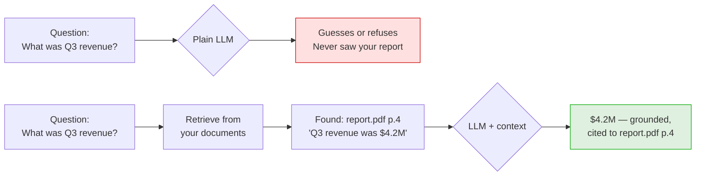
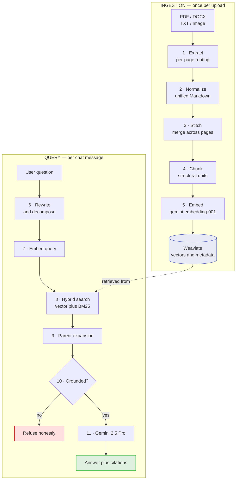
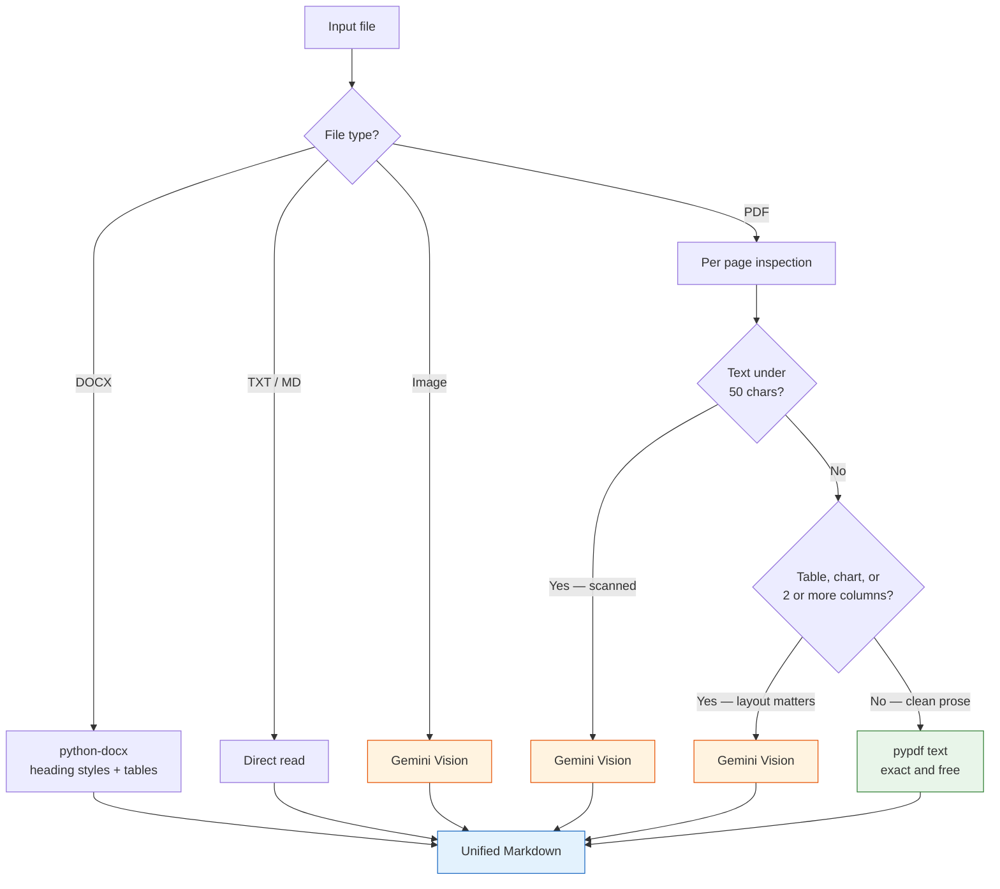
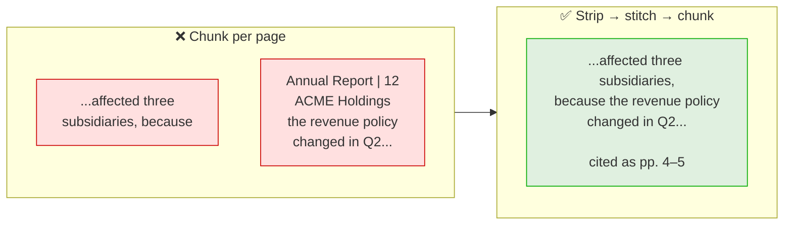
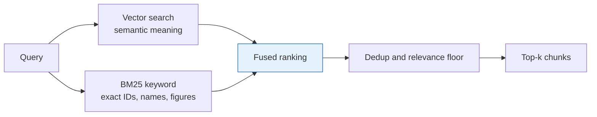
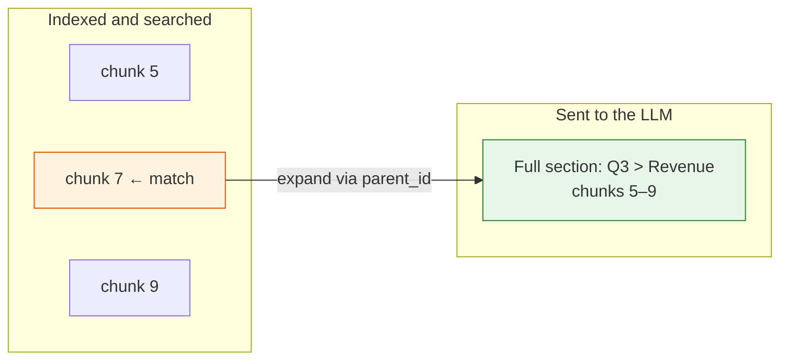
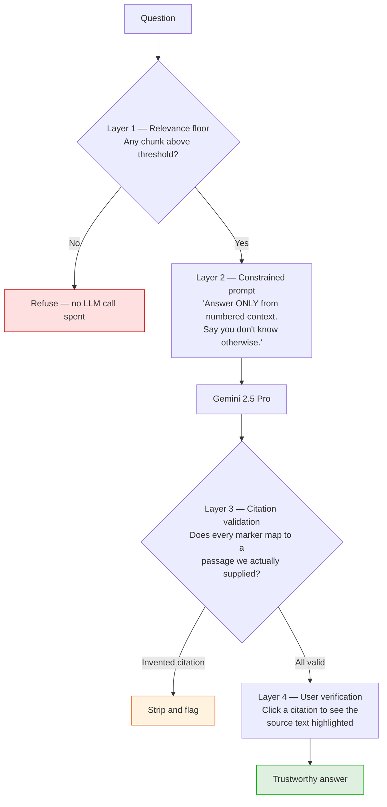

# Document-Aware AI Chatbot (RAG)

A chatbot that accepts **PDF, DOCX, TXT, and image** uploads and answers natural-language questions **using only the uploaded content**, returning a citation to the exact source passage.

Built with **Google Vertex AI** (Gemini 2.5 Pro for generation and vision, `gemini-embedding-001` for embeddings) and **Weaviate** as the vector database.

---

## 1. The problem

A Large Language Model has two hard limits:

1. **It has never seen your private data.** Contracts, internal reports, and scanned invoices were not in its training set.
2. **It answers anyway.** Asked something it doesn't know, an LLM will often produce a fluent, confident, wrong answer.

**Retrieval-Augmented Generation (RAG)** addresses both: instead of asking the model to recall, we *retrieve* the relevant passages from the user's documents and supply them as context, with a strict instruction to answer from that text or say it doesn't know.



---

## 2. Architecture

Two flows. **Ingestion** runs once per uploaded document. **Query** runs per chat message.



The four required components map onto numbered stages:

| Required component | Stage |
|---|---|
| **Chunking** | 4 — structural chunker |
| **Embeddings** | 5 (documents) and 7 (query) |
| **Retrieval** | 8–9 — hybrid search + parent expansion |
| **LLM generation** | 11 — Gemini 2.5 Pro, context-constrained |

---

## 3. Document ingestion

### Extraction — one output format, four input formats

The four input types express structure in four different ways:

- **TXT** — a blank line is a real paragraph break.
- **DOCX** — no line breaks at all; paragraphs are XML elements and tables are nested structures.
- **Digital PDF** — a line break is usually a *word wrap*, not a paragraph. Columns interleave.
- **Scanned PDF / image** — no text at all, only pixels.

The design principle is therefore **normalise the output, not the input**: every extractor emits the same structured Markdown, so nothing downstream knows which path produced a block.

Vision is applied **per page, driven by evidence** — used where it wins, skipped where exact text already exists:



The vision prompt is **structure-preserving**: headings stay headings, tables become Markdown tables, reading order is corrected for columns, and charts get a description — so figures become queryable rather than lost.

### Page boundaries are repaired before chunking

A page break is an artifact of layout, not meaning. Chunking page-by-page produces fragments that begin mid-sentence with the running header and page number wedged into the middle:



The whole document is assembled into one Markdown stream **before** chunking. Order matters — strip furniture first, or the footer gets welded into the sentence:

1. **Strip repeating furniture** — lines recurring at the same position across pages, plus standalone page numbers.
2. **Stitch paragraphs** — join across a page break when the previous block doesn't end in `.` `?` `!` `:` and the next doesn't start a new structure. Repair hyphenated splits (`sub-\nsidiaries` → `subsidiaries`).
3. **Stitch tables** — merge a table continued on the next page. A half-table without its header row is a reliable source of wrong numbers.
4. **Keep provenance** — merged blocks carry a page *range*, so citations read `report.pdf, pp. 4–5`.

---

## 4. Chunking strategy

Chunking defines the unit of retrieval. Too small and a chunk loses the context needed to answer; too large and its embedding becomes a blurry average that matches nothing precisely.

This system chunks on **structural units, not character counts**:

| Rule | Rationale |
|---|---|
| A section under a heading = one chunk | Follows the author's own unit of thought |
| **Tables are atomic** — never row-split | A split table loses its header row and yields wrong numbers |
| **Heading path prefixed** before embedding — `Annual Report > Q3 > Revenue` | Restores the context a bare excerpt loses; a large retrieval gain for almost no cost |
| Target **~600 tokens**, **15% overlap** | Large enough to hold a complete argument; small enough that top-k fits alongside chat history. Overlap stops an answer straddling a boundary from being halved |
| Oversized sections split recursively: sub-heading → paragraph → sentence | Structure first, arbitrary cuts only as a last resort |

Chunks from the same section share a `parent_id`, which is what makes parent-document retrieval possible at query time.

---

## 5. Embeddings

Chunks are embedded with Vertex AI `gemini-embedding-001` and stored in Weaviate with their metadata.

Document and query embeddings use the **asymmetric task types** the model supports — `RETRIEVAL_DOCUMENT` when indexing, `RETRIEVAL_QUERY` when searching. Both live in the same vector space but are optimised for their role, which measurably improves retrieval quality.

Weaviate is configured with self-provided vectors: embeddings come from Vertex AI, and Weaviate never vectorizes anything itself.

---

## 6. Retrieval

### Hybrid search

Pure vector search misses exact tokens — invoice numbers, surnames, SKUs. Pure keyword search misses paraphrase. Weaviate runs both and fuses the rankings:



### Parent-document retrieval — match small, answer big

Small chunks make matching precise; the model then receives the **enclosing section** so it has enough context to answer completely.



Capped at three parent sections and truncated to a fixed context budget so large sections cannot overflow the window. Citation spans still point at the originally matched chunk, keeping highlighting precise.

### Bounded query handling

Two retrieval rounds maximum:

1. **Decomposition** — a multi-part question ("compare A and B") is split into sub-queries retrieved independently. A single embedding of both halves retrieves neither well.
2. **One retry** — if nothing clears the relevance floor, the query is reformulated once before refusing, converting a class of false refusals into correct answers.

---

## 7. Answer generation and grounding

Preventing hallucination is enforced at **four independent layers**, rather than trusting the prompt alone:



Layers 1 and 3 are **code, not prompting**, which is what makes them reliable. Layer 1 in particular: when retrieval finds nothing relevant the system refuses *before calling the LLM at all* — a model that is never asked cannot hallucinate.

Every response carries a `grounded: true|false` flag and a confidence score.

### The relevance floor measures similarity, not search score

Worth calling out, because getting it wrong silently disables the guardrail.

Weaviate's hybrid search returns a **fused, relative score**: results are normalised against each other, so the best hit of any query scores ≈1.0 — even when the corpus contains nothing relevant. Thresholding that number makes every question look well-supported.

The floor is therefore applied to a quantity that is **independent of the result set**: the raw cosine similarity between the query and chunk vectors.

```
hybrid fusion score  →  ranking      (which passage is best?)
cosine similarity    →  grounding    (is any passage actually relevant?)
```

---

## 8. Bonus features

| Feature | How it works |
|---|---|
| **Chat history (memory)** | Recent turns rewrite a follow-up into a standalone query — *"what about the second one?"* becomes *"what was Subsidiary B's Q3 revenue?"* Without this, follow-up retrieval fails because the pronoun carries no searchable meaning |
| **Multi-document querying** | Search spans the whole collection by default; an optional filter and per-document checkboxes let the user scope it |
| **Source citation highlighting** | Chunks store character offsets. Clicking an inline `[n]` chip opens a panel showing the source passage with the cited span highlighted |
| **Groundedness guardrail** | The four layers above, plus an explicit `grounded` flag and confidence score per answer |

---

## 9. Technology

| Layer | Choice | Why |
|---|---|---|
| LLM + vision | **Gemini 2.5 Pro** (Vertex AI) | One model for answers *and* document vision — no separate OCR dependency |
| Embeddings | **`gemini-embedding-001`** | Same provider; asymmetric task types improve retrieval |
| Vector database | **Weaviate** | Vector-native, hybrid search as a first-class primitive |
| API | **FastAPI** | Async, typed, self-documenting via OpenAPI |
| Frontend | Vanilla HTML/CSS/JS | No build step required for a single page |

---

## 10. Running the project

### Prerequisites
- Python 3.10+
- Docker (for Weaviate)
- A Google Cloud project with the Vertex AI API enabled

### Start

```bash
# 1. Vector database
docker compose up -d weaviate

# 2. Dependencies
python -m venv .venv
.venv\Scripts\activate            # Windows
pip install -r requirements.txt

# 3. Configuration
cp .env.example .env              # set PROVIDER, GCP_PROJECT_ID, GCP_REGION

# 4. Run
uvicorn backend.main:app --reload
```

Open <http://localhost:8000> for the UI, or <http://localhost:8000/docs> for the API.

Sample documents covering all four input types are in [samples/](samples/).

### Configuration

```ini
PROVIDER=vertex
GCP_PROJECT_ID=your-project-id
GCP_REGION=us-central1
WEAVIATE_HOST=localhost

CHUNK_TARGET_TOKENS=600
CHUNK_OVERLAP_RATIO=0.15
TOP_K=5
```

> An offline mode (`PROVIDER=dev`) runs the entire pipeline with deterministic stub embeddings and no cloud credentials. It exists so the pipeline and test suite run without a network, and is not representative of answer quality.

---

## 11. API

| Method | Endpoint | Purpose |
|---|---|---|
| `POST` | `/documents` | Upload and ingest a document |
| `GET` | `/documents` | List ingested documents |
| `DELETE` | `/documents/{id}` | Remove a document and its chunks |
| `POST` | `/chat` | Ask a question (optional `doc_ids`, `session_id`) |
| `GET` | `/chat/{session_id}` | Retrieve conversation history |

**`POST /chat` response:**

```json
{
  "answer": "Q3 revenue was $4.2M, up 12% year over year [1].",
  "grounded": true,
  "confidence": 0.87,
  "citations": [
    {
      "n": 1,
      "doc_name": "annual_report.pdf",
      "page_start": 4, "page_end": 5,
      "heading_path": "Annual Report > Q3 > Revenue",
      "chunk_text": "...Q3 revenue was $4.2M, up 12%...",
      "highlight_start": 42, "highlight_end": 119
    }
  ]
}
```

---

## 12. Example questions

Five questions that exercise each capability:

| # | Ask | Demonstrates |
|---|---|---|
| 1 | A fact from one document | Retrieval and accurate citation with page number |
| 2 | A question spanning two documents | Multi-document querying |
| 3 | *"How do X and Y compare on Z?"* | Query decomposition |
| 4 | A follow-up using a pronoun | Chat memory / query rewriting |
| 5 | **"Who won the 2019 Cricket World Cup?"** | **Grounding — explicit refusal, `grounded: false`, no invented citations** |

Question 5 is the important one: an answer there would be a hallucination, so the refusal is the correct behaviour.

---

## 13. Project structure

```
backend/
  main.py              FastAPI app, startup, static mount
  config.py            typed settings
  models.py            Block · Chunk · RetrievedChunk · Citation
  providers/           model backends behind one interface
  ingest/
    extract.py         per-page routing: text vs vision
    normalize.py       unified Markdown → structural blocks
    stitch.py          strip furniture, merge across page breaks
    chunk.py           structural chunker, atomic tables, parent ids
    pipeline.py        orchestration
  store/
    weaviate_store.py  schema, upsert, hybrid search
    registry.py        document metadata
  rag/
    rewrite.py         history-aware rewriting + decomposition
    retrieve.py        hybrid search + parent expansion + retry
    generate.py        prompting, grounding gate, citation validation
    session.py         chat history
  api/                 documents.py · chat.py
frontend/              index.html · app.js · style.css
tests/                 chunking, stitching, grounding
samples/               one document of each supported type
```

---

## 14. Tests

```bash
pytest
```

29 tests covering the behaviour that matters most:

- **Chunking** — sections follow headings, tables are never split, heading paths nest correctly, words are never cut in half, offsets resolve back to the document.
- **Stitching** — running headers and page numbers are stripped, paragraphs split across pages are reassembled with a page range, hyphenated words are repaired, and complete sentences are *not* incorrectly merged.
- **Grounding** — an empty retrieval refuses without calling the model, invented citation markers are stripped and reported, and citation highlight spans land inside the displayed text.
